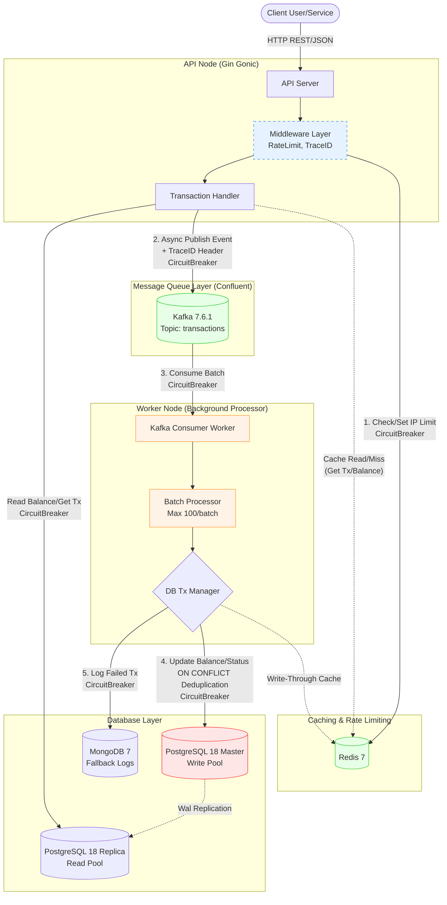

# Capstone B.4 : Exploding User Data Scalabilities

Prototype sistem transaksi user yang scalable, low-latency, dan reliable menggunakan Go. Fokus pada resilience, observability, dan handling overload.

## Tech Stack
- **Backend**: Go 1.24 + Gin Gonic
- **Database**: PostgreSQL (transaksi utama) + MongoDB (logging & data fleksibel)
- **Caching & Rate Limiting**: Redis
- **Message Queue**: Kafka (Confluent)
- **Connection Pooler**: PgBouncer (transaction pooling, port 6432)
- **Resilience**: Circuit Breaker (gobreaker) dengan EOF-aware filtering, Retry with Backoff, Batch Processing
- **Logging & Observability**: Zerolog (structured JSON) + Trace ID propagation + Prometheus metrics + Grafana dashboard
- **Deployment**: Docker + Docker Compose (monorepo: API + Worker)
- **Load & Chaos Testing**: k6 (performance_test.js & chaos_test.js di folder tests/k6/)

## Arsitektur Sistem Flow


## Fitur Utama & Resilience
- Rate limiting per IP/user (Redis)
- Async processing transaksi via Kafka (producer di API, consumer di Worker)
- Connection pooling berlapis: PgBouncer (transaction mode, max 10.000 client conn) di depan pgxpool (Read/Write Separation Master/Replica)
- Circuit Breaker di semua external call (Kafka producer/consumer, Postgres, Mongo) dengan filter `io.EOF` agar idle connection re-sync tidak mentrigger breaker trip
- Retry with exponential backoff untuk transient error
- Batch processing di Kafka consumer (max 100 concurrent proses event per batch)
- Structured logging (zerolog JSON) di seluruh flow
- Trace ID propagation: dari API request → Kafka header → Worker proses event
- Caching balance & transaction status di Redis
- Observability via Prometheus metrics (Gin requests, custom breaker/cache) + Grafana dashboard real-time (RPS, p95 latency dengan threshold SLO, error rate, breaker state/trips, cache hit rate)

## Arsitektur Sistem



## Struktur Proyek
```
capstone-go/
├── cmd/
│   ├── api/          # HTTP server (Gin)
│   └── worker/       # Kafka consumer worker
├── internal/
│   ├── application/  # Business logic / service
│   ├── config/       # Load .env + viper
│   ├── delivery/     # Handler & middleware Gin
│   ├── domain/       # Models & entities
│   ├── infrastructure/
│   │   ├── cache/    # Redis client
│   │   ├── database/ # Postgres & Mongo
│   │   ├── logging/  # Zerolog init + helper
│   │   ├── queue/    # Kafka producer & consumer
│   │   └── resilience/ # Circuit breaker + retry
├── .env              # Config environment
├── docker-compose.yml
└── README.md
```

## Cara Jalankan Lokal (Dev)
1. Install dependencies:
   ```
   go mod tidy
   ```

2. Copy `.env.example` ke `.env` dan isi (password DB, dll).

3. Jalankan dengan hot-reload (pakai Air):
   ```
   air
   ```

4. Akses API:
   - Health check: http://localhost:8000/health
   - POST transaction: http://localhost:8000/transactions
   - GET balance: http://localhost:8000/users/1/balance
   - GET transaction: http://localhost:8000/transactions/{txId}

## Cara Jalankan dengan Docker
```bash
# Gunakan flag --compatibility jika limit resource (CPU/Memory) tidak teraplikasi pada environment non-Swarm
docker compose up --build -d --compatibility
```

- API: http://localhost:8000
- Worker: berjalan di background, consume Kafka
- Postgres: http://localhost:5432
- Mongo: http://localhost:27017
- Redis: http://localhost:6379
- Kafka: http://localhost:9092
- Prometheus: http://localhost:9090
- Grafana: http://localhost:3000

## Unit Testing

Unit test mencakup handler, repository, resilience (circuit breaker & retry), dan backpressure.

### Menjalankan Test

```bash
# Semua unit test
go test ./...

# Dengan coverage
go test -cover ./...
```

## Cara Tes Resilience & Observability
1. **Normal flow**:
   - POST /transactions → cek log API (publish success) & log worker (processed success)
   - Lihat trace_id sama di log API & worker

2. **Simulasi failure — Database**:
   - Stop Postgres: `docker stop tx-postgres-primary`
   - Spam POST → API return 503 cepat (breaker trip), worker retry lalu skip proses
   - Start lagi: `docker start tx-postgres-primary` → recovery otomatis

3. **Simulasi failure — PgBouncer (Connection Pooler)**:
   - Stop PgBouncer: `docker stop tx-pgbouncer`
   - API akan return 503 dari breaker; log akan menampilkan EOF error
   - Start lagi: `docker start tx-pgbouncer`
   - **Catatan**: Sejak optimasi Phase 2, error `io.EOF` yang muncul saat PgBouncer restart **tidak** mentrigger circuit breaker trip. Sistem membedakan antara "Database Down" (trip) dan "Idle Connection Re-sync / Pooler Restart" (no trip). Observasi di Grafana: `breaker_trips_total` tidak naik saat PgBouncer di-restart.

4. **Simulasi overload**:
   - Gunakan k6 load test (lihat bagian Load Test di bawah)

## Load & Chaos Testing dengan k6

Script testing berada di folder `tests/k6/`:

- `performance_test.js`: Load test normal (smoke, load, stress, spike, soak)
- `chaos_test.js`: Simulasi failure (Postgres/Redis/Kafka down)

Cara jalankan (dari root proyek):

```bash
# Performance test — pilih profil dengan TEST_PROFILE
k6 run -e TEST_PROFILE=smoke  tests/k6/performance_test.js --summary-export=smoke_summary.json
k6 run -e TEST_PROFILE=load   tests/k6/performance_test.js --summary-export=load_summary.json
k6 run -e TEST_PROFILE=stress tests/k6/performance_test.js --summary-export=stress_summary.json
k6 run -e TEST_PROFILE=spike  tests/k6/performance_test.js --summary-export=spike_summary.json
k6 run -e TEST_PROFILE=soak   tests/k6/performance_test.js --summary-export=soak_summary.json
```
```bash
# Chaos test — postgres primary down
docker stop tx-postgres-primary
k6 run tests/k6/chaos_test.js --env CHAOS_TARGET=postgres --summary-export=chaos_postgres.json
docker start tx-postgres-primary
```
```bash
# Chaos test — redis down
docker stop tx-redis
k6 run tests/k6/chaos_test.js --env CHAOS_TARGET=redis --summary-export=chaos_redis.json
docker start tx-redis
```
```bash
# Chaos test — kafka down
docker stop tx-kafka
k6 run tests/k6/chaos_test.js --env CHAOS_TARGET=kafka --summary-export=chaos_kafka.json
docker start tx-kafka
```
K6 Testing Result

[Link Google Sheet Hasil Testing K6](https://docs.google.com/spreadsheets/d/1MeOlugkW6gw524ed3eTZDOFPl-spz2XyKEeltw5GJrA/edit?usp=sharing)

## Observability & SLO Dashboard (Grafana)
- Prometheus scrape metrics dari endpoint `/metrics` di API
- Grafana tampilkan real-time:
  - Requests per Second (RPS)
  - Latency p95 (threshold alert merah >500ms untuk SLO breach)
  - Error Rate (%)
  - Circuit Breaker State & Trips Count per komponen (Postgres, Kafka, Mongo)
  - Cache Hit Rate (%) — Redis cache-aside untuk `GetUserBalance` & `GetByTxID`
  - **PgBouncer Pool Utilization**: active connections, idle connections, waiting connections per database (`capstone` / `capstone_read`)
  - pgxpool stats: acquired, idle, total connections per pool (write/read)

Cara akses:
1. Buka http://localhost:3000
2. Login: capstone / admin123 (ganti password setelah login)
3. Dashboards → New → Import → upload `grafana-dashboard.json` di root proyek
4. Pilih datasource Prometheus (URL: http://prometheus:9090)
5. Import → dashboard langsung muncul
6. Refresh dashboard saat test k6 → lihat RPS naik, latency spike, cache hit rate tinggi

Dashboard di-export ke `grafana-dashboard.json` supaya bisa di-import ulang di mesin lain.

## SLO Target (Target Capaian)
- **p95 latency < 500ms** di normal load 
- Error rate < 1% saat normal load; toleransi < 10% saat chaos (failure injection)
- Breaker aktif proteksi sistem (fast fail 503); EOF dari PgBouncer **tidak** mentrigger trip
- Trace ID konsisten end-to-end (API → Kafka header → Worker)
- Cache hit rate >80% pada read-heavy workload (balance & transaction lookup)
- PgBouncer pool utilization < 80% dari `default_pool_size` saat peak load

## Catatan Pengembangan
- Logging sekarang full zerolog JSON + trace ID propagation
- Semua external call dilindungi breaker + retry
- Batch processing batasi concurrent proses di worker (max 100 per batch)
- Observability menggunakan Prometheus + Grafana untuk monitor RPS, latency, error, breaker, cache secara real-time

## Next Step (Ongoing)
- Autentikasi JWT (login + protect endpoint)
- Tambah endpoint GET /users/:id/transactions (history tx)
- CI/CD GitHub Actions (test otomatis)
- Custom Error Response standar
- Capacity Planning & SLO Report (dari k6)
- Partitioning/Sharding DB
- Cloud Deployment (AWS/GCP)

## Completed
- ✅ Kubernetes Minikube + HPA lokal (manifest tersedia di `k8s/`, panduan di bawah)

---

## Kubernetes: Production Deployment & HPA Scaling Demo

Panduan ini mencakup seluruh alur dari environment setup, deployment berurutan (menghindari race condition), validasi HPA, hingga demo scaling real-time dengan k6.

> **Stack yang di-deploy**: API + Worker + PostgreSQL + PgBouncer (connection pooler). Redis, Kafka, Mongo tetap berjalan di host via Docker Compose dan diakses melalui `host.minikube.internal`.

---

### Prerequisites

Pastikan tools berikut sudah terinstal:

```powershell
# Cek versi
kubectl version --client
minikube version
k6 version
docker --version
```

Install via Chocolatey jika belum ada:

```powershell
choco install kubernetes-cli minikube
```

---

### Step 1 — Hindari Port Collision dengan Docker Compose

Minikube dan Docker Compose bisa bentrok di port yang sama (8000, 5432, 6432) saat menggunakan `kubectl port-forward`. Matikan Docker Compose terlebih dahulu sebelum sesi Minikube:

```powershell
# Hentikan semua container Docker Compose (data tetap tersimpan di volume)
docker compose down

# Verifikasi tidak ada container aktif di port yang digunakan
docker ps --format "table {{.Names}}\t{{.Ports}}"
```

> **Catatan**: Redis dan Kafka diakses pod via `host.minikube.internal` (langsung bekerja). Mongo memerlukan konfigurasi jaringan tambahan di Step 2 karena routing Docker Desktop ke `host.minikube.internal:27017` bisa terinterupsi oleh native `mongod.exe` di Windows. Jalankan layanan yang diperlukan:
> ```powershell
> docker compose up -d redis kafka mongo zookeeper
> ```

---

### Step 2 — Start Minikube dan Sambungkan MongoDB ke Cluster Network

`metrics-server` adalah **wajib** untuk HPA. Tanpanya, kolom `TARGETS` di HPA akan selalu menampilkan `<unknown>` dan auto-scaling tidak akan pernah terjadi.

```powershell
# Start Minikube dengan resource yang cukup untuk semua pod
minikube start --driver=docker --memory=4096 --cpus=4

# Enable metrics-server (wajib untuk HPA CPU/Memory)
minikube addons enable metrics-server

# Verifikasi metrics-server running
kubectl get deployment metrics-server -n kube-system
# Expected: READY 1/1

# Tunggu ~60 detik lalu verifikasi metrics tersedia
kubectl top nodes
# Expected: tampil CPU dan MEMORY usage (bukan error)
```

**Sambungkan MongoDB ke Minikube Docker network (wajib untuk Windows):**

Di Windows, Docker Desktop merutekan koneksi `host.minikube.internal` melalui `127.0.0.1` di host. Jika native `mongod.exe` berjalan di port 27017, pod akan terhubung ke MongoDB yang salah (tanpa user) dan mendapatkan `Authentication failed`. Solusinya: sambungkan container `tx-mongo` langsung ke Docker network Minikube sehingga pod dapat mengaksesnya via IP internal.

```powershell
# Sambungkan tx-mongo ke Minikube Docker network
docker network connect minikube tx-mongo

# Dapatkan IP tx-mongo di network Minikube
$MONGO_IP = docker inspect tx-mongo --format "{{.NetworkSettings.Networks.minikube.IPAddress}}"
Write-Host "tx-mongo IP di Minikube network: $MONGO_IP"
# Expected: 192.168.49.3 (atau IP lain di range 192.168.49.x)
```

> **Jika IP berbeda dari `192.168.49.3`**, update baris `MONGO_URI` di `k8s/secret.yaml`:
> ```yaml
> MONGO_URI: "mongodb://mongo:capstone123@<IP_HASIL>:27017/capstone?authSource=admin"
> ```
> Ulangi step ini setiap kali Minikube di-restart dari awal (IP bisa berbeda setiap sesi).

---

### Step 3 — Build Images Langsung ke Minikube (Tanpa `image load`)

`imagePullPolicy: Never` di deployment berarti Kubernetes tidak akan pull dari registry eksternal — image **harus ada** di Docker daemon Minikube. Cara paling efisien adalah build langsung ke dalam daemon Minikube:

```powershell
# Arahkan Docker CLI ke daemon Minikube (satu sesi terminal)
& minikube -p minikube docker-env --shell powershell | Invoke-Expression

# Verifikasi: Docker sekarang terhubung ke Minikube
docker info | Select-String "Name"
# Expected: Name: minikube

# Build kedua image (dari root proyek)
docker build -f Dockerfile.api -t capstone-project-api:latest .
docker build -f Dockerfile.worker -t capstone-project-worker:latest .

# Konfirmasi image ada di Minikube
docker images | Select-String "capstone-project"
# Expected: capstone-project-api   latest   ...
#           capstone-project-worker latest  ...
```

> **Jika membuka terminal baru**, perintah `& minikube docker-env | Invoke-Expression` harus dijalankan ulang karena environment variable tidak persisten antar session.

---

### Step 4 — Deploy Berurutan (Menghindari Race Condition)

Urutan ini kritis. App akan crash saat startup jika PgBouncer belum ready karena `ConnectPostgres()` memanggil `log.Fatal()` pada connection failure.

```powershell
# [1/5] Credentials dan Config — tidak ada dependensi
kubectl apply -f k8s/secret.yaml
kubectl apply -f k8s/configmap.yaml

# [2/5] Database — tunggu sampai readiness probe lulus
kubectl apply -f k8s/postgres.yaml
kubectl wait --for=condition=ready pod -l app=postgres --timeout=120s
# Expected: pod/postgres-xxxx condition met

# [3/5] Connection Pooler — tunggu postgres benar-benar siap menerima koneksi
kubectl apply -f k8s/pgbouncer.yaml
kubectl wait --for=condition=ready pod -l app=pgbouncer --timeout=60s
# Expected: pod/pgbouncer-xxxx condition met

# [4/5] Aplikasi + Service
kubectl apply -f k8s/deployment-api.yaml
kubectl apply -f k8s/deployment-worker.yaml
kubectl apply -f k8s/service-api.yaml

# [5/5] HPA (setelah deployment API terdaftar)
kubectl apply -f k8s/hpa-api.yaml
```

Cek status keseluruhan setelah semua selesai:

```powershell
kubectl get pods,svc,hpa
# Expected: semua pod STATUS=Running, READY=1/1 (atau 2/2 untuk API)
```

---

### Step 5 — Verifikasi PgBouncer & Health Check API

```powershell
# Cek PgBouncer pool aktif
kubectl exec deploy/postgres -- psql -h pgbouncer -p 6432 -U postgres -d pgbouncer -c "SHOW POOLS;"
# Expected: baris capstone dan capstone_read dengan sv_idle > 0 (koneksi idle siap)
# Jika sv_login > 0 dan sv_idle = 0: PgBouncer masih mencoba login ke Postgres — tunggu atau cek log pgbouncer

# Test API health
# Catatan Windows (Docker driver): minikube ip:NodePort tidak accessible langsung dari host.
# Gunakan port-forward ke localhost sebagai gantinya:
kubectl port-forward svc/bankx-api 30080:8000
# (biarkan berjalan di terminal ini, buka terminal baru untuk curl di bawah)

# Di terminal lain:
curl.exe "http://localhost:30080/health"
# Expected: {"status":"healthy","components":{"pgbouncer":"up","postgres_primary":"up",...}}

# Cek log API memuat PgBouncer dengan benar
kubectl logs deploy/bankx-api | Select-String "pgbouncer"
# Expected: "Connected to PostgreSQL via PgBouncer" pgbouncer_addr="pgbouncer:6432"
```

> **Jika `curl` timeout (Failed to connect):** Ini bukan masalah network Minikube, melainkan readiness probe API belum lulus.
> NodePort Service hanya meneruskan traffic ke pod yang **Ready** (READY=1/1). Jika semua pod API masih READY=0/1, Service tidak punya endpoint aktif dan curl akan selalu timeout.
>
> Diagnosis:
> ```powershell
> kubectl get pods -l app=bankx-api          # Cek kolom READY
> kubectl logs deploy/bankx-api | tail -20    # Cek komponen apa yang down
> kubectl logs deploy/pgbouncer | tail -20    # Cek apakah PgBouncer bisa resolve postgres
> ```
> Fix umum: pastikan PgBouncer sudah `READY=1/1` sebelum mengecek curl.

---

### Step 6 — Validasi HPA

```powershell
kubectl get hpa bankx-api-hpa
```

**Output yang diharapkan:**

```
NAME            REFERENCE             TARGETS         MINPODS   MAXPODS   REPLICAS
bankx-api-hpa   Deployment/bankx-api  8%/70%, 12%/80%  2        10        2
```

**Jika TARGETS masih `<unknown>/70%`:**

```powershell
# 1. Pastikan metrics-server pod running
kubectl get pods -n kube-system | Select-String "metrics-server"

# 2. Pastikan deployment API punya resources.requests (wajib untuk HPA)
kubectl describe deployment bankx-api | Select-String -A 3 "Requests"
# Harus ada: cpu: 200m, memory: 150Mi

# 3. Tunggu 60-90 detik — metrics-server butuh waktu scrape pertama kali
# Cek apakah node metrics sudah tersedia
kubectl top pods -l app=bankx-api
# Jika masih error, restart metrics-server:
kubectl rollout restart deployment metrics-server -n kube-system
```

---

### Step 7 — HPA Scaling Demo dengan k6

Buka **4 terminal** secara bersamaan untuk observasi real-time.

**Terminal 0 — Port-Forward (wajib untuk Windows Docker driver, biarkan berjalan):**

```powershell
# Expose bankx-api ke localhost:8080 agar dapat diakses dari host
kubectl port-forward svc/bankx-api 8080:8000
```

**Terminal 1 — Jalankan k6 load test:**

```powershell
# Profil 'stress' — ramp hingga 3000 VU selama ~13 menit, cukup untuk trigger HPA
k6 run `
  -e BASE_URL="http://localhost:8080" `
  -e TEST_PROFILE=stress `
  tests/k6/performance_test.js `
  --summary-export=k8s_stress_summary.json
```

**Terminal 2 — Monitor HPA setiap 5 detik:**

```powershell
# Watch HPA — perhatikan kolom TARGETS dan REPLICAS berubah
kubectl get hpa bankx-api-hpa -w
```

**Terminal 3 — Monitor jumlah Pod:**

```powershell
# Watch pod scaling up dan down
kubectl get pods -l app=bankx-api -w
```

**Urutan kejadian yang diharapkan:**

```
t=0m    REPLICAS=2  CPU≈8%   — baseline
t=3m    CPU≥70%              — HPA mendeteksi overload
t=4m    REPLICAS=4           — scale up (+2 pod per 15s)
t=6m    REPLICAS=6-8         — terus naik mengikuti load
t=8m    REPLICAS=10          — maksimum (3000 VU peak)
t=13m   k6 ramp down
t=14m   CPU turun < 70%
t=15m   stabilizationWindow 60s mulai
t=16m   REPLICAS=9           — scale down (-1 pod per 30s)
t=18m   REPLICAS=2           — kembali ke minimum
```

**Verifikasi zero-downtime saat scale-down (Terminal 4 opsional):**

```powershell
# Loop request tiap 1 detik — harus semua HTTP 200, tidak ada error
# (Terminal 0 dengan port-forward harus tetap berjalan)
while ($true) {
    try {
        $r = Invoke-WebRequest "http://localhost:30080/health" -UseBasicParsing -TimeoutSec 3
        Write-Host "$(Get-Date -Format HH:mm:ss)  $($r.StatusCode)"
    } catch {
        Write-Host "$(Get-Date -Format HH:mm:ss)  ERROR - $($_.Exception.Message)" -ForegroundColor Red
    }
    Start-Sleep 1
}
```

---

### Troubleshooting

#### Pod CrashLoopBackOff

```powershell
# Lihat reason crash
kubectl describe pod -l app=bankx-api | Select-String -A 10 "Events:"

# Lihat log dari container yang sudah mati
kubectl logs -l app=bankx-api --previous

# Kasus paling umum: PgBouncer belum ready saat API start
# Solusi: pastikan pgbouncer pod sudah Running sebelum apply deployment-api.yaml
kubectl get pods -l app=pgbouncer
# Jika tidak Running, cek:
kubectl describe pod -l app=pgbouncer
```

#### ErrImagePull / ImagePullBackOff

```powershell
# Penyebab: image tidak ada di Docker daemon Minikube
# Cek apakah image ada
& minikube -p minikube docker-env --shell powershell | Invoke-Expression
docker images | Select-String "capstone-project"

# Jika tidak ada, build ulang (pastikan sudah menjalankan docker-env lebih dulu)
docker build -f Dockerfile.api -t capstone-project-api:latest .
docker build -f Dockerfile.worker -t capstone-project-worker:latest .

# Restart deployment agar Kubernetes re-pull
kubectl rollout restart deployment bankx-api bankx-worker
```

#### HPA TARGETS `<unknown>`

```powershell
# Cek apakah metrics-server bisa scrape pod
kubectl top pods
# Jika error "metrics not available yet", tunggu 60-90 detik

# Cek apakah resources.requests terdefinisi (wajib untuk HPA)
kubectl get deployment bankx-api -o jsonpath='{.spec.template.spec.containers[0].resources}'
# Harus ada: {"limits":{"cpu":"700m","memory":"300Mi"},"requests":{"cpu":"200m","memory":"150Mi"}}

# Hard reset metrics-server
kubectl delete pod -n kube-system -l k8s-app=metrics-server
```

#### Postgres Pod Tidak Bisa Start (password mismatch)

```powershell
# Cek log postgres
kubectl logs -l app=postgres

# Jika error "password authentication failed" atau pod restart terus:
# Data directory sudah ter-init dengan password lama. Hapus pod agar re-init.
kubectl delete pod -l app=postgres
# Pod baru akan dibuat otomatis dengan password dari secret.yaml (capstone123)
```

#### Cleanup

```powershell
# Hapus semua resource K8s (data tidak persisten karena tanpa PVC)
kubectl delete -f k8s/

# Stop Minikube (hemat resource, data cluster tersimpan)
minikube stop

# Hapus cluster sepenuhnya (opsional)
minikube delete

# Kembalikan Docker ke daemon host
[System.Environment]::SetEnvironmentVariable("DOCKER_TLS_VERIFY", $null, "Process")
[System.Environment]::SetEnvironmentVariable("DOCKER_HOST", $null, "Process")
[System.Environment]::SetEnvironmentVariable("DOCKER_CERT_PATH", $null, "Process")
[System.Environment]::SetEnvironmentVariable("MINIKUBE_ACTIVE_DOCKERD", $null, "Process")

# Restart Docker Compose untuk development lokal
docker compose up -d --compatibility
```